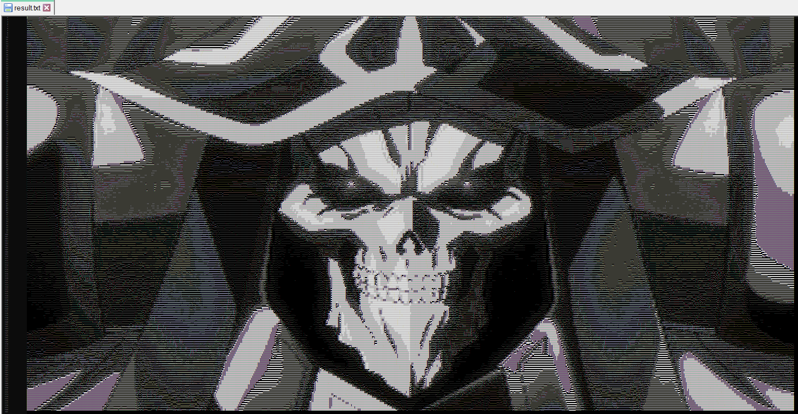
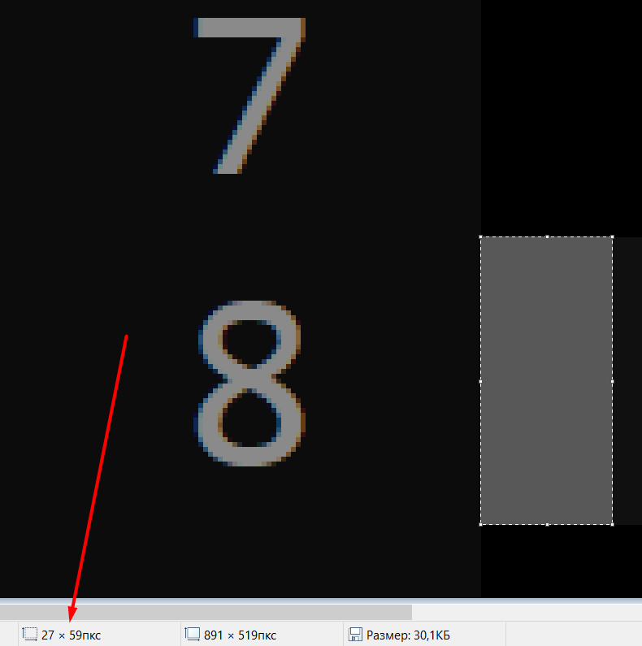
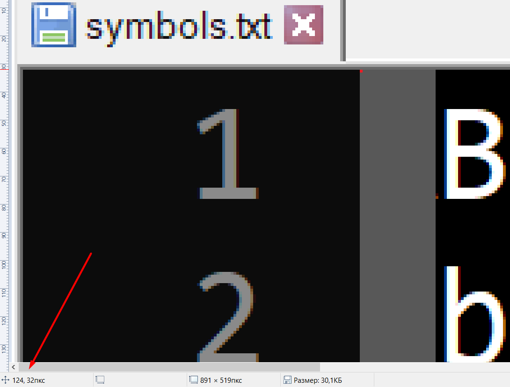

# ASCII-Art-Converter
Adds the *AsciiArtPreset* and *AsciiArtConverter* classes to create ASCII art from images.
## Usage:
To create ASCII art, you need to load a preset from a JSON file, call the static method *convert* of the *AsciiArtConverter* class, passing the path to the source image and the loaded preset as parameters, and save the result to a text file.

```python
from asccii_art import AsciiArtPreset, AsciiArtConverter

preset = AsciiArtPreset('presets/Notepad++WhiteOnBlack.json')
art = AsciiArtConverter.convert('image.png', preset)
with open('result.txt', 'w', encoding='utf-8') as file:
    file.write(art)
```
## Result

You can specify the **width** and **height** of the ASCII art, but it's better to specify only one of these parameters, then the second parameter will be calculated automatically and the image will keep its proportions.
```python
from asccii_art import AsciiArtPreset, AsciiArtConverter

preset = AsciiArtPreset('presets/Notepad++WhiteOnBlack.json')
art = AsciiArtConverter.convert('image.png', preset, output_width=100, output_height=50)
with open('result.txt', 'w', encoding='utf-8') as file:
    file.write(art)
```
Such a beautiful result was obtained by individually calculating the brightness of each character for a particular text editor. Usually, to create ASCII art, interpolation of the brightness of a pixel by a character index from a certain set is used. My option uses the search for the most suitable symbol based on its average brightness specified in the preset.

The *presets* folder contains JSON files with presets I created. However, you can create your own presets using the *generate_preset* method of the *AsciiArtPreset* class.

## Creating Your Own Preset
1. Make sure all characters are the same width and height in the text editor you are using. Otherwise, this method does not work.
2. You should write some of the characters that you plan to use in ASCII graphics, zoom in as close as possible to the text, and take a screenshot of the text editor.

3. Now you need to know the width and height of the character, as well as the starting position of the text. To do this, you should use an image editor, such as Paint. I specifically highlighted one space below the text (gray rectangle). If you select this rectangle in the image editor, then you will know the width and height of the character.
4. We now know the character width and height (27 x 59). Next, you need to find the coordinates of the beginning of the text. To do this, it is most convenient to copy the gray rectangle and paste it from the top butt to butt until we reach the very first character of the text. The coordinates of the upper left corner of the gray rectangle are the coordinates of the beginning of the text (124, 32).
5. All is ready. It remains only to start the creation of the preset, specifying the path to the screenshot, the entered text, the width and height of the character, the coordinates of the beginning of the text. The entered text is easier to just copy and paste in triple quotes.
```python
from asccii_art import AsciiArtPreset


preset = AsciiArtPreset()
entered = """ABCDEFGHIJKLMNOPQRSTUVWXYZ
abcdefghijklmnopqrstuvwxyz
 1234567890!@#$%^&*()-_=+,
.<>;':"/?\|[]{}`~█▓▒░▄▌▐▀│
┤╡╢╖╕╣║╗╝╜╛┐└┴┬├─┼╞╟╚╔╩╦╠═
╬╧╨╤╥╙╘╒╓╫╪┘┌"""
width = 27
height = 59
x = 124
y = 32
preset.generate_preset('screen.png', entered, width, height, x, y)
preset.save('presets\\MyNewPreset.json')
```
The saved preset (*MyNewPreset.json*) looks like this:
```json
{
    "width": 27,
    "height": 59,
    "brightness": {
        "A": 0.2059331419849013,
        "B": 0.24437238958164598,
        "C": 0.16271582599248957,
        "D": 0.225529424763313,
        "E": 0.1890831999962835,
        "F": 0.15858488761345974,
        "G": 0.21844324136514628,
        "H": 0.20427843448817146,
        "I": 0.1599359162048355,
        "J": 0.1410977614523851,
        "K": 0.19004530168579603,
        "L": 0.1272439081909817,
        "M": 0.24174176850221796,
        "N": 0.23648724297125817,
        "O": 0.2246355829709964,
        "P": 0.18678468342873744,
        "Q": 0.26851744862433036,
        "R": 0.22116663900031783,
        "S": 0.18380480596183676,
        "T": 0.1333582960309953,
        "U": 0.19387570941757823,
        "V": 0.18111687722305445,
        "W": 0.23759949896885407,
        "X": 0.20267574382166917,
        "Y": 0.14824037332799123,
        "Z": 0.17928829110861383,
        "a": 0.1900421358805196,
        "b": 0.21159831186882028,
        "c": 0.1302823952660853,
        "d": 0.21362448775798162,
        "e": 0.18987186886361754,
        "f": 0.16619721858589728,
        "g": 0.28043502419047645,
        "h": 0.18887640834210123,
        "i": 0.14952587476751567,
        "j": 0.17426246992949018,
        "k": 0.18051978731955162,
        "l": 0.15368634899606967,
        "m": 0.21219945696031814,
        "n": 0.16124367440906745,
        "o": 0.177677956957882,
        "p": 0.20953582770938162,
        "q": 0.2154434949656791,
        "r": 0.12060120170473163,
        "s": 0.14873590643845183,
        "t": 0.15772228068034747,
        "u": 0.16182161959598848,
        "v": 0.13427069219446405,
        "w": 0.1929237629538219,
        "x": 0.14874995809210698,
        "y": 0.18064649825930873,
        "z": 0.1461179624548122,
        " ": 0.0,
        "1": 0.15647689814537236,
        "2": 0.1746826440162877,
        "3": 0.17182012044761386,
        "4": 0.1933453104577196,
        "5": 0.17771770168357265,
        "6": 0.20916770997220646,
        "7": 0.13713839510248751,
        "8": 0.2464628862722988,
        "9": 0.20644243145722369,
        "0": 0.25217051904545157,
        "!": 0.09652221897461472,
        "@": 0.34014077675094656,
        "#": 0.232813481245571,
        "$": 0.24872961458545087,
        "%": 0.24957863306941203,
        "^": 0.0741329053489764,
        "&": 0.2720901797797438,
        "*": 0.09973156141190873,
        "(": 0.12902914036571858,
        ")": 0.12836651587077483,
        "-": 0.036735620352320905,
        "_": 0.06758167966521167,
        "=": 0.10831492697713661,
        "+": 0.11276496474606691,
        ",": 0.06349344829275823,
        ".": 0.03290298500366167,
        "<": 0.0912421701605112,
        ">": 0.08979285395058427,
        ";": 0.09316436403529564,
        "'": 0.034385333015027476,
        ":": 0.06023614114113223,
        "\"": 0.06603132358923021,
        "/": 0.10380801103376806,
        "?": 0.12486417091224858,
        "\\": 0.10380002757395239,
        "|": 0.12905198094544365,
        "[": 0.156016469687429,
        "]": 0.16375199858920034,
        "{": 0.1522571428007979,
        "}": 0.1534581842619483,
        "`": 0.01994287516011132,
        "~": 0.08204705423231735,
        "█": 0.996829775061871,
        "▓": 0.8072369573078138,
        "▒": 0.309208015412803,
        "░": 0.15774950836588542,
        "▄": 0.4908259346477278,
        "▌": 0.49646964826121087,
        "▐": 0.4925766849987952,
        "▀": 0.4931836638923186,
        "│": 0.1477463396585032,
        "┤": 0.17492107714446017,
        "╡": 0.1883293088560799,
        "╢": 0.3028671158017962,
        "╖": 0.17357417190965413,
        "╕": 0.13409322677718272,
        "╣": 0.3129444098068223,
        "║": 0.28300823319378343,
        "╗": 0.21150474560743457,
        "╝": 0.20659737633686898,
        "╜": 0.16878130358241458,
        "╛": 0.13203247078641428,
        "┐": 0.10807572391500134,
        "└": 0.10507501979560431,
        "┴": 0.13441296151229895,
        "┬": 0.1367982870368035,
        "├": 0.1744589572880377,
        "─": 0.06779661016949151,
        "┼": 0.20341463837961085,
        "╞": 0.1881179921598608,
        "╟": 0.30316742967946647,
        "╚": 0.2068032672995394,
        "╔": 0.21206034299935186,
        "╩": 0.2372618864250215,
        "╦": 0.24216628208028676,
        "╠": 0.31372900908539114,
        "═": 0.13542932684408066,
        "╬": 0.34329355982974036,
        "╧": 0.18989441080962938,
        "╨": 0.19773680739521923,
        "╤": 0.19212793250579321,
        "╥": 0.20230067383580738,
        "╙": 0.1686668026390888,
        "╘": 0.13140434031058462,
        "╒": 0.1353827311317646,
        "╓": 0.17384193159144976,
        "╫": 0.32298411786639564,
        "╪": 0.24647851552801617,
        "┘": 0.10620907939838599,
        "┌": 0.10746034532010897
    }
}
```
As you can see, the preset stores not only the average brightness of each character, but also the width and height of the character. This is necessary in order to render ASCII art while maintaining the aspect ratio of the original image.

You cannot save a preset with an existing name. This is to ensure that you don't accidentally overwrite an existing preset, so you will need to delete the old preset before creating a new one with the same name.